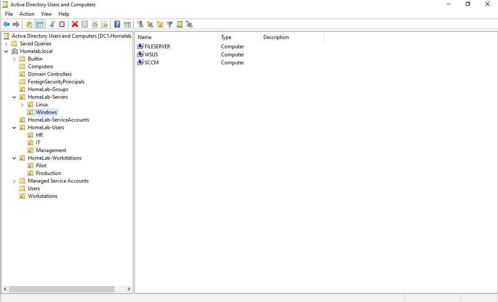
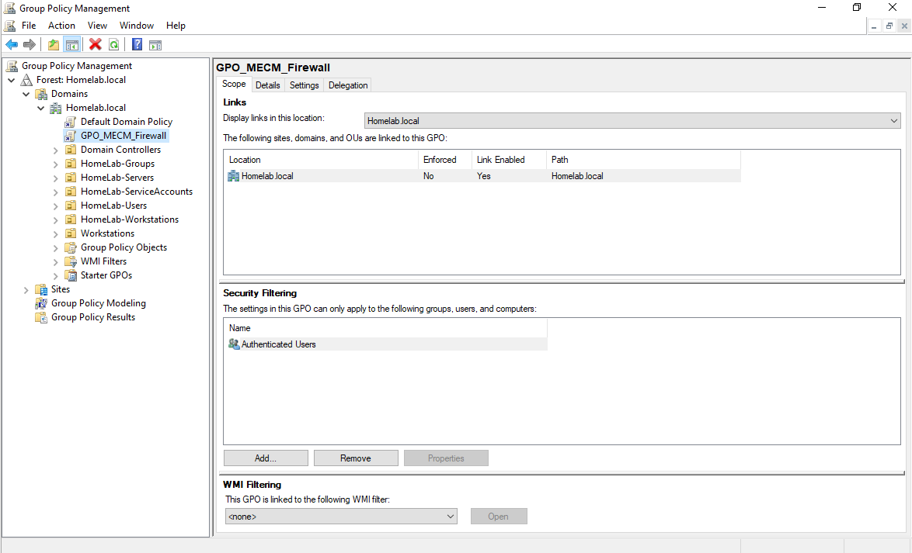
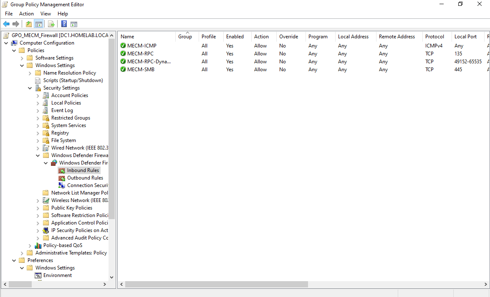

# 01 — Active Directory + DNS

**Server:** DC1 | Windows Server 2022 | IP: 192.168.5.180  
**Domain:** homelab.local

---

## Overview

This is the foundation of the entire lab. DC1 acts as the primary Domain Controller, DNS server, and Group Policy management point for all machines in the `homelab.local` domain.

---

## OU Structure

The OU layout mirrors a typical enterprise environment with separate containers for servers, workstations, users, groups, and service accounts:

```
homelab.local
│
├── OU=HomeLab-Servers
│   ├── OU=Windows        ← FILESERVER, WSUS
│   └── OU=Linux          ← FEDORA-44-SERVER
│
├── OU=HomeLab-Workstations
│   ├── OU=Pilot          ← WIN11HR1, WIN11HR2  (WSUS/MECM Pilot ring)
│   └── OU=Production     ← WIN10MGMT1, WIN10MGMT2 (WSUS/MECM Production ring)
│
├── OU=HomeLab-Users
│   ├── OU=IT             ← jszwed, mkowalski, anotewa
│   ├── OU=HR             ← anowak, kzielinska
│   └── OU=Management     ← kibisz, morlos
│
├── OU=HomeLab-Groups
└── OU=HomeLab-ServiceAccounts
```



---

## Users

| Username | Full Name | Department |
|----------|-----------|------------|
| jszwed | Jakub Szwed | IT |
| mkowalski | Michał Kowalski | IT |
| anotewa | Adam Notewa | IT |
| anowak | Anna Nowak | HR |
| kzielinska | Kasia Zielińska | HR |
| kibisz | Krzysztof Ibisz | Management |
| morlos | Maciej Orłoś | Management |
| svc_sccm | SCCM Service Account | Service Accounts |

---

## Security Groups (in OU=HomeLab-Groups)

| Group | Purpose | Members |
|-------|---------|---------|
| GG_IT_Admins | IT admin access | jszwed, mkowalski |
| GG_HR | HR users | anowak, kzielinska |
| GG_Management | Management users | kibisz, morlos |
| GG_File_RW | File share read/write | — |
| GG_File_Read | File share read-only | — |
| GG_RemoteDesktopUsers | RDP access | anotewa, jszwed |
| GG_WSUS_Admins | WSUS administration | — |

---

## Group Policy

### GPO: GPO_MECM_Firewall
Linked to: `homelab.local` (applies domain-wide)

Inbound firewall rules created:

| Rule Name | Protocol | Port | Purpose |
|-----------|----------|------|---------|
| MECM-RPC | TCP | 135 | RPC endpoint mapper |
| MECM-SMB | TCP | 445 | SMB file sharing |
| MECM-RPC-Dynamic | TCP | 49152–65535 | Dynamic RPC |
| MECM-ICMP | ICMPv4 | — | Ping (connectivity testing) |





### GPO: GPO_WSUS_Pilot + GPO_WSUS_Production
Linked to their respective Workstations OUs — see the [WSUS section](../02-WSUS/README.md) for full details.

---

## Notes

- `jszwed` was added to `Domain Admins` and local `Administrators` for lab purposes (Client Push installation, SCCM management)
- Schema was extended for SCCM using `extadsch.exe` — `jszwed` was temporarily added to `Schema Admins` and removed after
- `CN=System Management` container created in ADSI Edit with full control granted to the `SCCM$` computer account

