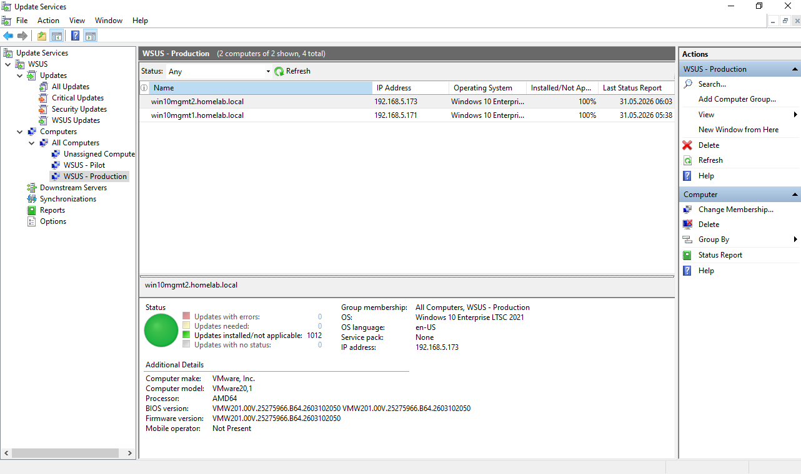
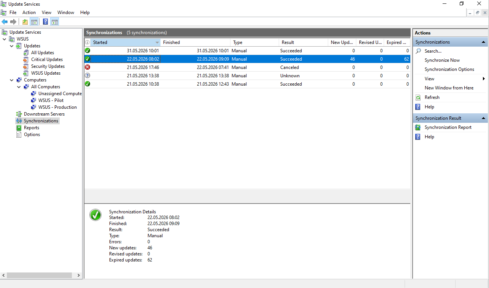
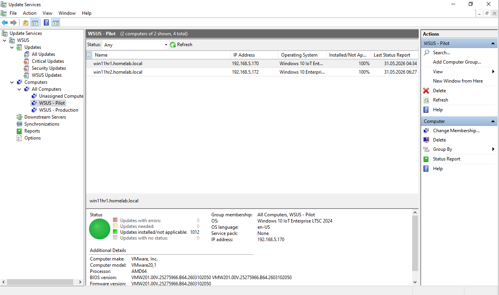
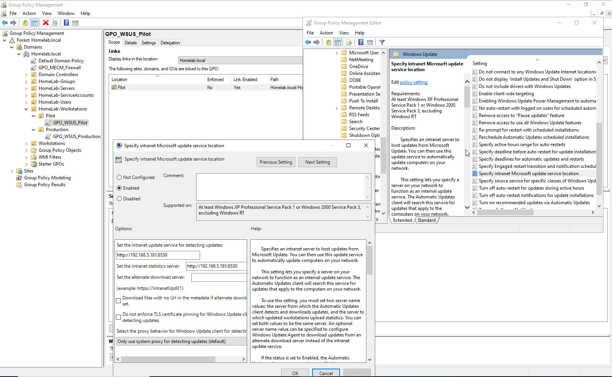
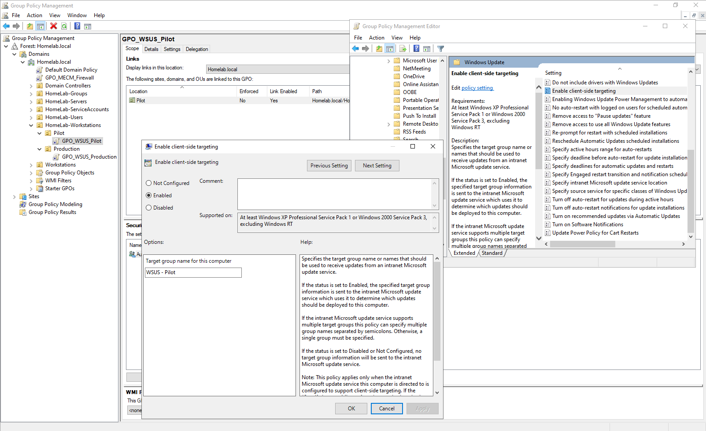
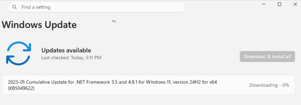

# 02 — WSUS (Windows Server Update Services)

**Server:** WSUS | Windows Server 2022 | IP: 192.168.5.181

---

## Overview

WSUS is configured as the central update distribution point for all Windows workstations in the lab. It integrates directly with MECM (see [04 — MECM/SCCM](../04-MECM-SCCM/README.md)) as the upstream update source for the Software Update Point.

The WSUS setup demonstrates a realistic **deployment ring strategy** — updates are tested on Pilot machines (Windows 11) before being rolled out to Production (Windows 10).

---

## Installation & Configuration

- Installed via **Add Roles and Features** on Windows Server 2022
- Database: **Windows Internal Database (WID)**
- Update storage: `C:\WSUS` (local path)
- Sync source: **Microsoft Update** (directly, no upstream WSUS)
- No proxy configured

### Products selected:
- Windows 10
- Windows 11

### Classifications selected:
- Critical Updates
- Definition Updates
- Security Updates

> ⚠️ "Upgrades" and "Microsoft Security Essentials" were intentionally excluded after troubleshooting performance issues (see below).



---

## Troubleshooting — WSUS Sync Deadlocks

After initial setup, WSUS failed to synchronize. The log at `%ProgramFiles%\Update Services\LogFiles\SoftwareDistribution.log` revealed:

```
Execution Timeout Expired
Unable to acquire database synchronization mutex
ExecuteSPImportUpdate caught a deadlock SqlException
```

**Root cause:** The WID database was being overwhelmed — SQL deadlocks during update import, combined with IIS memory limits causing timeouts.

**Resolution:**

1. Added more RAM to the WSUS VM
2. Removed "Upgrades" from Classifications and "Microsoft Security Essentials" from Products (reduced update volume)
3. In IIS Manager → Application Pools → **WsusPool**:
   - `Private Memory Limit (KB)` → set to `0` (unlimited)
   - `Queue Length` → set to `25000`
4. Restarted services:

```powershell
iisreset /stop
Start-Service -Name w3svc
Start-Service -Name wsusservice
```

**Result:** WSUS completed full synchronization within ~1 hour. ✅



---

## Deployment Rings

The patching strategy separates workstations into two rings:

| Group | Machines | OS | Ring |
|-------|----------|----|------|
| WSUS - Pilot | WIN11HR1, WIN11HR2 | Windows 11 | Pilot (first) |
| WSUS - Production | WIN10MGMT1, WIN10MGMT2 | Windows 10 | Production (after validation) |

### GPO Configuration

Two GPOs were created on DC1:

- **GPO_WSUS_Pilot** → linked to `OU=HomeLab-Workstations\OU=Pilot`
- **GPO_WSUS_Production** → linked to `OU=HomeLab-Workstations\OU=Production`

Both GPOs configured under:
`Computer Configuration → Policies → Administrative Templates → Windows Components → Windows Update`

| Setting | Value |
|---------|-------|
| Intranet Microsoft update service location | `http://192.168.5.181:8530` |
| Configure Automatic Updates | `4 - Auto download and schedule install` |
| Schedule install day | Every day |
| Scheduled install time | 03:00 |
| Automatic Updates detection frequency | 6 hours |
| No auto-restart with logged on users | Enabled |
| Enable client-side targeting | `WSUS - Pilot` / `WSUS - Production` |







---

## Patch Lifecycle Demo

1. Filter updates: `Approval: Unapproved`, `Status: Failed or Needed`
2. Select an update → **Approve** for `WSUS - Pilot`, **Not Approved** for `WSUS - Production`
3. On client (WIN11HR2): Open Windows Update → Check for updates → update appears
4. After Pilot validation → Approve for `WSUS - Production`

Useful client-side commands:
```powershell
UsoClient StartScan
UsoClient RefreshSettings
gpupdate /force
gpresult /r /scope computer
```


