# 04 — MECM / SCCM (Microsoft Endpoint Configuration Manager)

**Server:** SCCM | Windows Server 2025 | IP: 192.168.5.185  
**Site Code:** LAB | **Site Name:** HomeLab MECM

---

## Overview

This is the core of the patch management setup. MECM is deployed as a **standalone primary site** and covers the full patch management lifecycle:

- Software Update Point integrated with WSUS
- Device collections mirroring deployment rings (Pilot / Production)
- Update deployment with scheduling and deadlines
- Application deployment (7-Zip via MSI)
- Monitoring and compliance reporting

---

## Prerequisites Installed

| Component | Notes |
|-----------|-------|
| SQL Server 2022 Developer Edition | Default instance (MSSQLSERVER), TCP/IP on port 1433 |
| SQL Server Management Studio (SSMS) | For SQL management |
| Windows ADK for Windows 11 | Deployment Tools + USMT |
| Windows PE Add-on | WinPE environment |
| IIS + Windows Features | Installed via PowerShell |
| WSUS Administration Console | Installed on SCCM for SUP role |

IIS installation command:
```powershell
Install-WindowsFeature Web-Server,Web-Windows-Auth,Web-ISAPI-Ext,Web-Metabase,Web-WMI,
Web-Asp-Net,Web-Asp-Net45,Web-Net-Ext,Web-Net-Ext45,NET-Framework-Features,
NET-Framework-45-Features,BITS,RDC -IncludeManagementTools
```

---

## AD Preparation

Before installing MECM, two steps were completed on DC1:

**1. Schema extension** (run from SCCM server as Schema Admin):
```
\SMSSETUP\BIN\X64\extadsch.exe
```
Result checked in `C:\ExtADSch.log` — successfully extended. `jszwed` was temporarily added to `Schema Admins` and removed afterwards.

**2. System Management container** created in ADSI Edit:
- Path: `CN=System Management, CN=System, DC=homelab, DC=local`
- `SCCM$` computer account granted **Full Control** on the container

**3. Service account** `svc_sccm` created in `OU=HomeLab-ServiceAccounts`, added to local Administrators on SCCM.

---

## Installation

MECM installed from ISO using `splash.hta`:

| Setting | Value |
|---------|-------|
| Site code | LAB |
| Site name | HomeLab MECM |
| SQL Server FQDN | SCCM.Homelab.local |
| Database name | CM_LAB |
| SMS Provider | SCCM.Homelab.local |
| Management Point | SCCM.Homelab.local (eHTTP) |
| Distribution Point | SCCM.Homelab.local (eHTTP) |

### Troubleshooting During Install

**Issue:** SQL Express (initial choice) is not supported by MECM.  
**Fix:** Rolled back via VM snapshot, reinstalled with SQL Server 2022 Developer Edition.

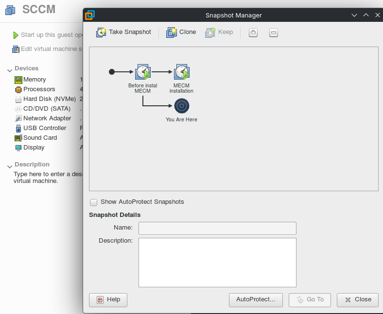

**Issue:** `NT SERVICE\MSSQLSERVER` account rejected during prerequisite check.  
**Fix:** Changed SQL service account to `Network Service` in SQL Server Configuration Manager.

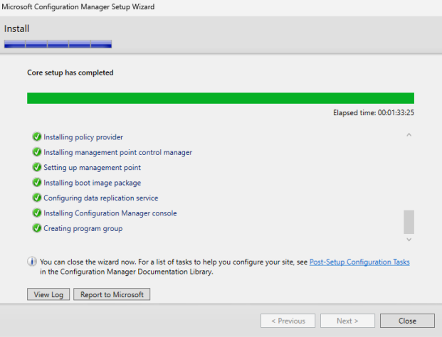

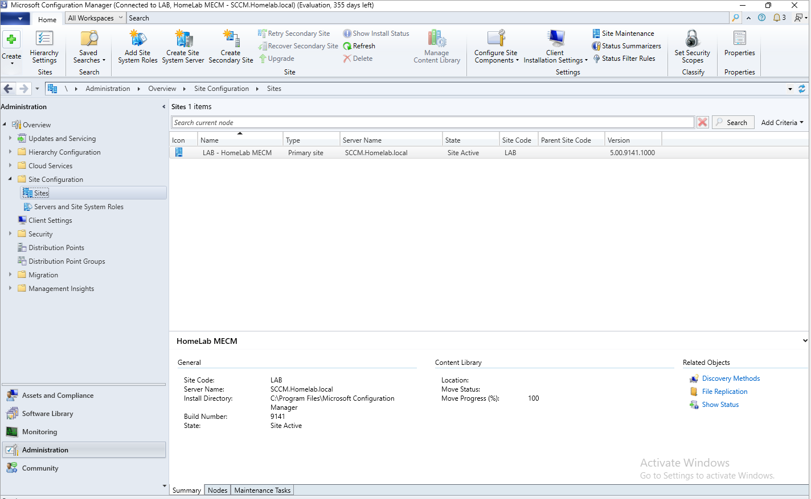


---

## Step 1 — Boundaries & Boundary Groups

**Boundary:**
- Type: IP Subnet
- Network: `192.168.5.0`
- Mask: `255.255.255.0`

**Boundary Group:** `BG_Homelab`
- Contains the above boundary
- Linked to SCCM.Homelab.local as site system server
- "Use this boundary group for site assignment" ✅

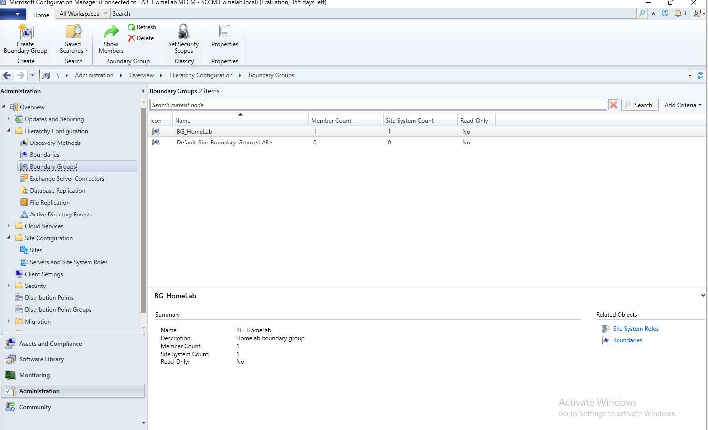

---

## Step 2 — Discovery Methods

Three discovery methods enabled:

| Method | Purpose |
|--------|---------|
| Active Directory System Discovery | Finds computers in AD |
| Active Directory User Discovery | Finds user accounts |
| Active Directory Group Discovery | Finds AD groups |

All configured with path: `LDAP://DC=Homelab,DC=local` (recursive search).  
Full Discovery triggered immediately after configuration.

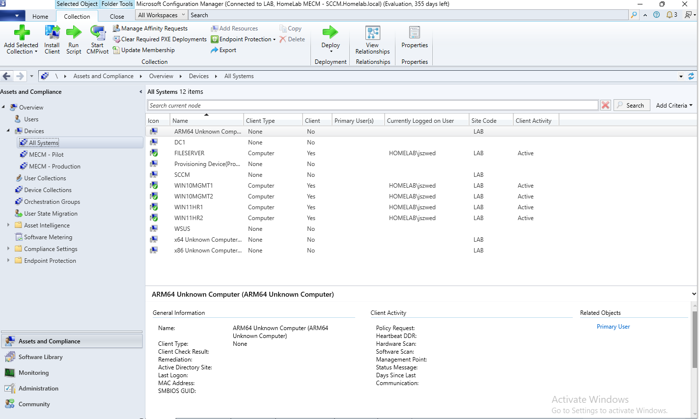

---

## Step 3 — Client Installation

**Client Push** was configured with `homelab\jszwed` as the push account.

Client Push failed silently on all targets. Resolved by installing the agent manually from each client:

```powershell
\\SCCM.Homelab.local\SMS_LAB\Client\ccmsetup.exe /mp:SCCM.Homelab.local SMSSITECODE=LAB
```


---

## Step 4 — Device Collections

| Collection | Query / Rule | Members |
|-----------|-------------|---------|
| MECM - Pilot | Direct Rule | WIN11HR1, WIN11HR2 |
| MECM - Production | Direct Rule | WIN10MGMT1, WIN10MGMT2 |

> Query Rules were attempted first using WQL (`SMS_R_System.OperatingSystemNameandVersion like "%Windows 11%"`), but machines did not appear in collections until inventory completed. Switched to Direct Rules for reliable results.

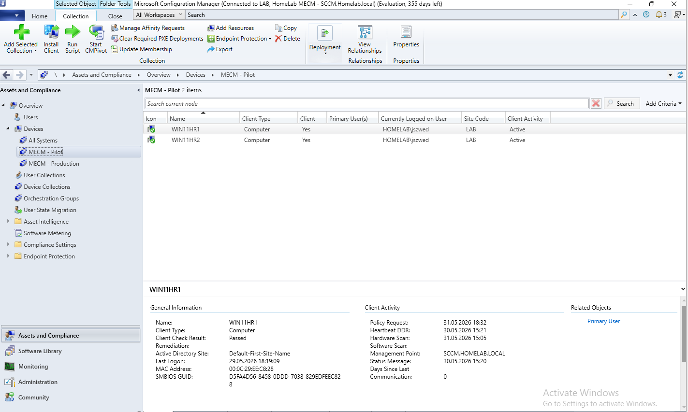

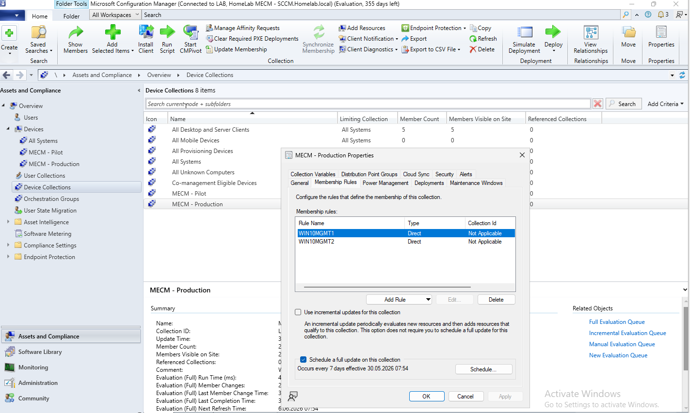

---

## Step 5 — Software Update Point (SUP)

WSUS.Homelab.local added as a Site System with the **Software Update Point** role.

| Setting | Value |
|---------|-------|
| WSUS Port | 8530 |
| SSL | Disabled |
| Sync source | WSUS.Homelab.local:8530 (upstream) |
| Sync schedule | Every 7 days |
| Classifications | Critical Updates, Definition Updates, Security Updates |
| Products | Windows 10 |

### Troubleshooting — SUP Sync Failure

**Issue 1:** `wsyncmgr.log` showed:
```
DB Server not detected for SUP WSUS.homelab.local from SCF File. skipping.
```

**Issue 2:** `WCM.log` showed:
```
System.Security.SecurityException: Request for principal permission failed.
```

**Root cause:** The `SCCM$` computer account lacked permissions on the WSUS server.

**Fix:**
```powershell
Add-LocalGroupMember -Group "WSUS Administrators" -Member "HOMELAB\SCCM$"
Restart-Service -Name SMS_EXECUTIVE
```

**Result in WCM.log after fix:**
```
Successfully connected to server: WSUS.homelab.local, port: 8530
Setting new configuration state to 2 (WSUS_CONFIG_SUCCESS)
```
✅

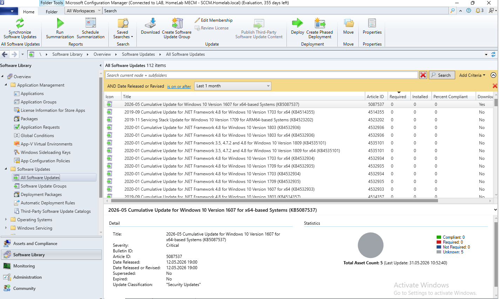

---

## Step 6 — Patch Deployment

**Software Update Group:** `SUG_Production_2026_05`  
**Deployment:** `DEP_Production_2026_05` → Collection: `MECM - Production`

Deployment settings:
- Type: **Required**
- Deadline: 7 days from creation
- Download: From the Internet
- Distribution Point: `\\SCCM.Homelab.local`

Deployment package source:
```powershell
New-Item -Path "C:\Sources\Updates\Production" -ItemType Directory -Force
New-SmbShare -Name "Sources" -Path "C:\Sources" -FullAccess "Everyone"
```

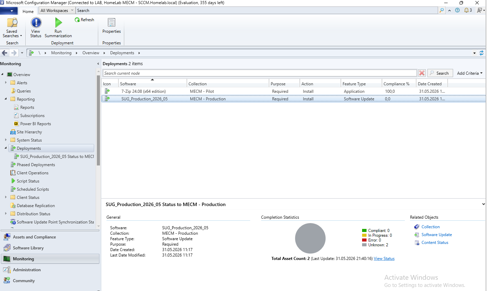


---

## Step 7 — Application Deployment (7-Zip)

7-Zip deployed to `MECM - Pilot` collection as a proof-of-concept for application management.

**Installer downloaded to SCCM:**
```powershell
$url = "https://www.7-zip.org/a/7z2408-x64.msi"
$dest = "C:\Sources\Apps\7Zip\7z2408-x64.msi"
New-Item -Path "C:\Sources\Apps\7Zip" -ItemType Directory -Force
Invoke-WebRequest -Uri $url -OutFile $dest
```

Application created in MECM using **Auto-detect from installation files** (MSI type).  
Deployed with:
- Action: **Install**
- Purpose: **Required**
- Distribution Point: `\\SCCM.Homelab.local`

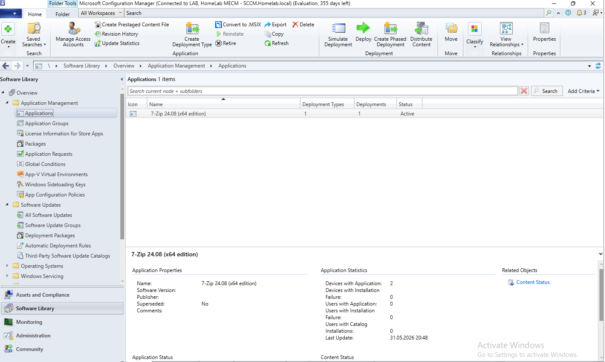

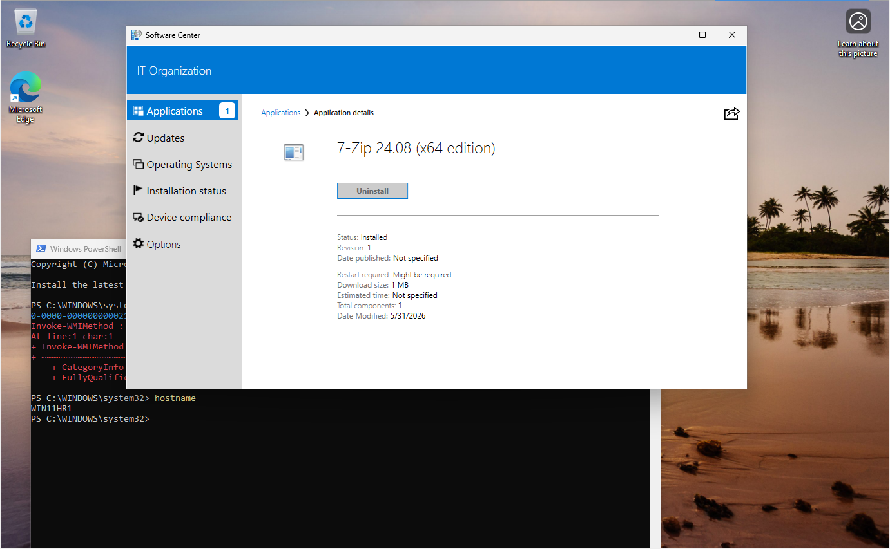

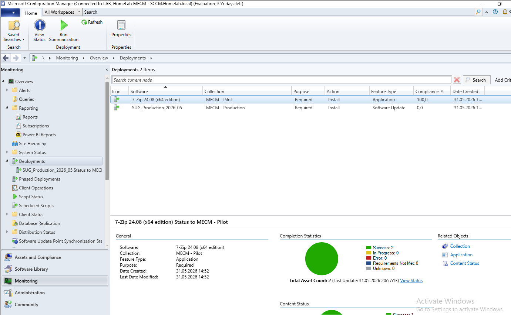

---

## Patch Management Lifecycle Summary

```
1. WSUS syncs updates from Microsoft Update
         ↓
2. MECM syncs from WSUS via Software Update Point
         ↓
3. Updates filtered and added to a Software Update Group
         ↓
4. SUG deployed to MECM - Pilot (WIN11) first
         ↓
5. Pilot machines install updates, compliance monitored
         ↓
6. After validation, SUG deployed to MECM - Production (WIN10)
         ↓
7. Compliance tracked in Monitoring → Deployments
```
